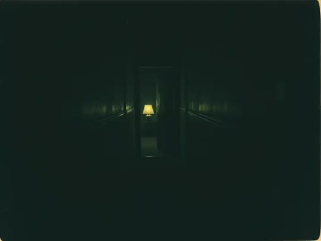
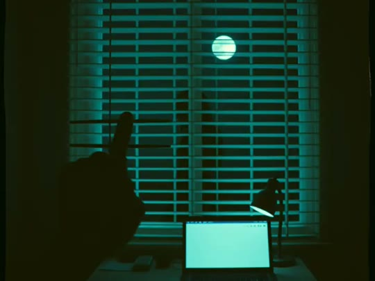
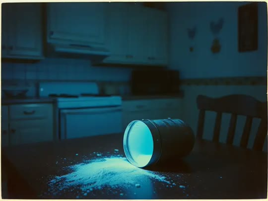
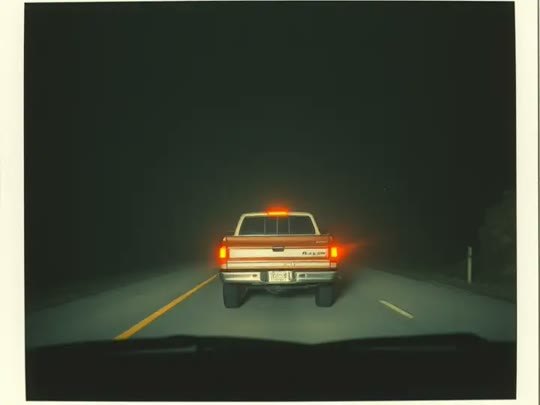
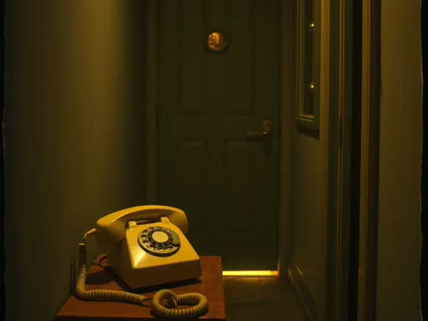
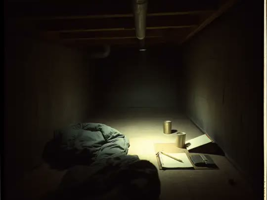
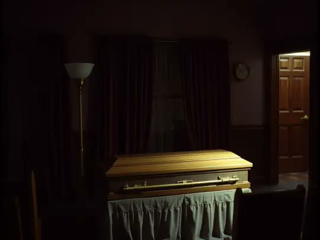
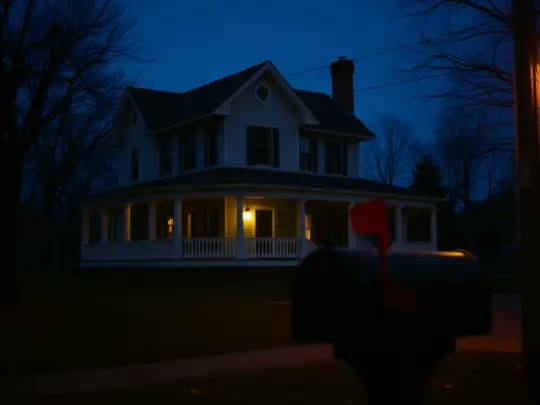

  

<h1 align="center">UNINVITED PRESENCE</h1>

<i>They were never invited in.</i>

  Short horror stories for iPhone and iPad, each inspired by a real account. 
  <b><a href="https://apps.apple.com/app/uninvited-presence/id6816024822">Free on the App Store</a>.</b>

  <a href="https://w3debugger.github.io/uninvited-presence-pages/"><b>Support</b></a>
  &nbsp;·&nbsp;
  <a href="https://w3debugger.github.io/uninvited-presence-pages/privacy.html"><b>Privacy</b></a>
  &nbsp;·&nbsp;
  <a href="https://github.com/w3debugger/uninvited-presence-pages/issues"><b>Report a problem</b></a>

---

## The cases

<table>
  <tr>
    <td width="50%"> <b>CASE 01 · The Walls</b> <i>Finals week. Things keep moving.</i></td>
    <td width="50%"> <b>CASE 02 · The Blinds</b> <i>Just a branch. Probably.</i></td>
  </tr>
  <tr>
    <td> <b>CASE 03 · Blue Dust</b> <i>It glows like sugar.</i></td>
    <td> <b>CASE 04 · Ridge Road</b> <i>Never stop on the ridge.</i></td>
  </tr>
  <tr>
    <td> <b>CASE 05 · The Survey</b> <i>Just a few questions, dear.</i></td>
    <td> <b>CASE 06 · Under the Floor</b> <i>The house was booked every weekend.</i></td>
  </tr>
  <tr>
    <td> <b>CASE 07 · Under the Bridge</b> <i>Watch the little boy's face.</i></td>
    <td> <b>CASE 08 · The Sleepers</b> <i>The freight elevator needs a key.</i></td>
  </tr>
  <tr>
    <td> <b>CASE 09 · The Watcher</b> <i>Welcome to the neighbourhood.</i></td>
    <td> <b>CASE 10 · Downstream</b> <i>Follow the water.</i></td>
  </tr>
</table>

<b>More cases are under investigation.</b> New stories will be added in future updates.

## What to expect

- **Short, self-contained stories.** Each case is its own place, its own people and its own night. Play them in any order.
- **Grounded in real events.** Every story is inspired by a real account; names and places are invented.
- **Fully voiced.** Every character speaks, and every setting has its own sound.
- **Made for a phone in your hands.** Landscape play with two-thumb controls: move on the left, look on the right.
- **Game Center achievements.** Survive a case to earn it. Optional; the game plays the same without it.
- **Small to install.** Some stories download the first time you open them, and you can remove them later to free space.

## Your privacy

Nothing on file. The game collects no personal data: no accounts, no ads, no analytics, no tracking. Settings and progress stay on your device. Read the full [privacy policy](https://w3debugger.github.io/uninvited-presence-pages/privacy.html).

## Need help?

Controls, saving, downloads and common questions are on the [support page](https://w3debugger.github.io/uninvited-presence-pages/). If something doesn't work, [open an issue](https://github.com/w3debugger/uninvited-presence-pages/issues) with your device model, iOS version and the case you were playing.

---

This repository holds the game's support and privacy pages, served by GitHub Pages. Uninvited Presence is a work of fiction.
